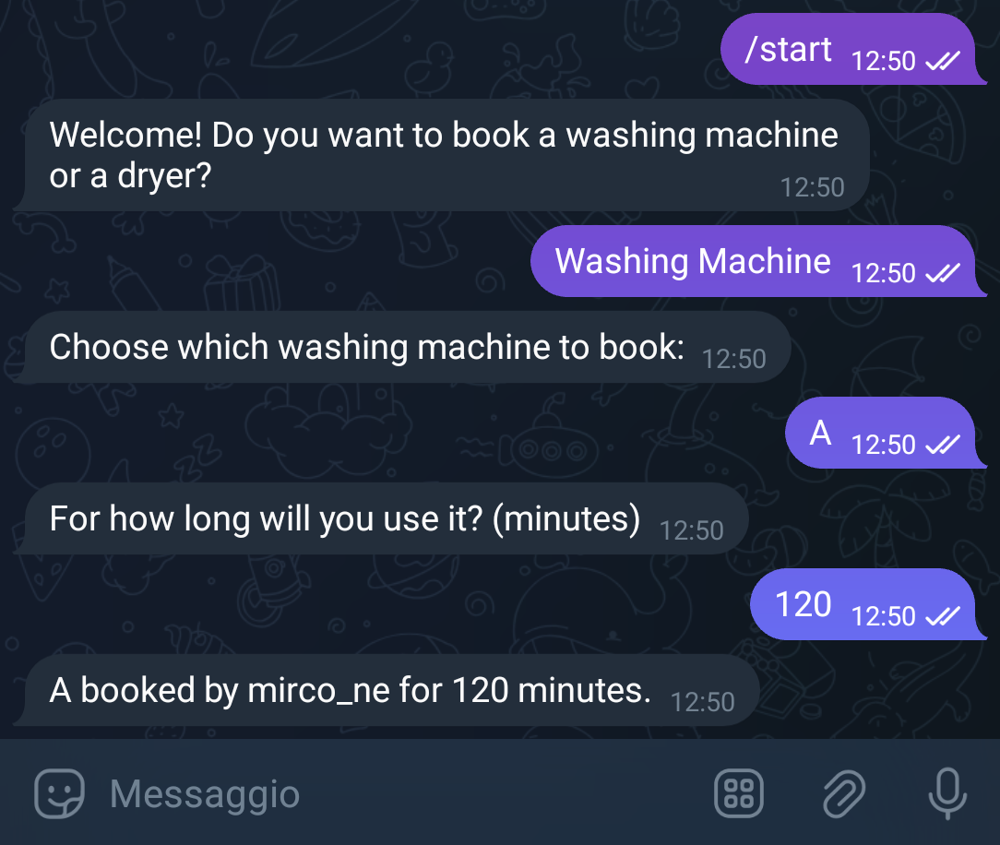

# 🧺 LaundryBot

 

LaundryBot is a Telegram bot that allows users to **manage laundry bookings** easily.  

I created this bot because in the student dormitory where I live in Trento, there is **no program to manage laundry reservations**. Every time someone wanted to book a washing machine or dryer, we had to manually write down who was using which machine.  

So I programmed this bot to **make the process simpler and automated**, allowing residents to book machines directly via Telegram.

---


<h2 align="center"> 📸 Before & After </h2>

<table align="center">
  <tr>
    <td align="center">
      <b>Before LaundryBot</b><br>
      <i>All bookings were done manually using many messages and notes</i>  <br>
    </td>
    <td align="center">
      <b>After LaundryBot</b><br>
      <i>Users book washing machines and dryers directly via Telegram </i>  <br>
    </td>
  </tr>  
      <td align="center">
      
      </td>
      <td align="center">
      
      </td>
</table>

---
 
## 🚀 Features
- 📅 `View` available time slots
- ✅ `Book` a laundry slot
- 🗑️ `Cancel` or update a booking
- 💾 `Store` data locally using JSON

---

## 🛠️ Technologies
- Python 3.10+
- Python telegram bot
- Flask (optional web integration)
- JSON for local data storage

---

## ⚙️ Installation (Win Terminal)

### 1️⃣Clone the repository
```
git clone https://github.com/mirconegri/LaundryBot.git
cd LaundryBot
```
### 2️⃣Create a virtual environment
```
python -m venv venv
source venv/bin/activate  # Windows: venv\Scripts\activate
```
### 3️⃣Install dependencies
```
pip install -r requirements.txt
```
### 4️⃣Configure the bot
Copy the example config:
```
cp config.example.py config.py
```
Edit config.py and add your 
`Telegram bot token`.
### 5️⃣Run the bot:
```
python app.py
```
---

## 🧾 Example Usage

User commands on Telegram:

- `/start`
- `/book`
- `/view`
- `/cancel`
- `/help`


---

## 📜 License

MIT License © 2025 `Mirco Negri`
— see [LICENSE](LICENSE) file for details.

---

## 👤 Author

`Mirco Negri`
GitHub: https://github.com/mirconegri


